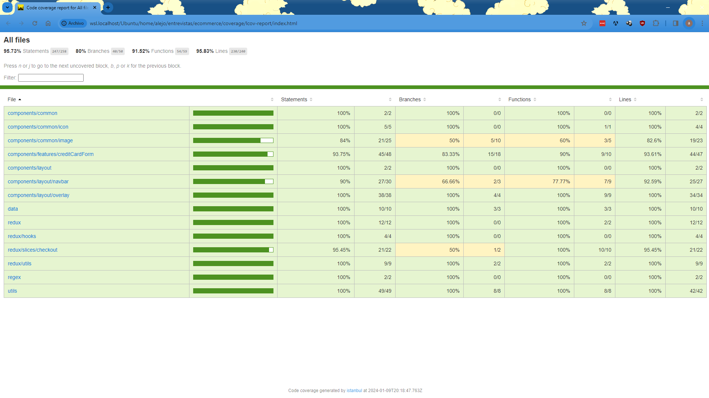

# Ecommerce

## instructions for running the app and tests

To run the project, we need to have the following tools

- Node in its lts version 18.17.1.
- git version 2.25.1.
- It is recommended to use yarn in its version 1.22.19 to download dependencies.

Next, we need to download the project from the following repository [Ecommerce repository](https://github.com/AlejoDev95/eccommerce).

After downloading, we access it from Visual Studio and install dependencies with the following command.

```sh
yarn install
```

After installing the dependencies, if we want to run the project, we need to execute the following command and access the route <http://localhost:5173>

```sh
yarn run dev
```

But if we want to run the tests, we need to execute one of the following commands.

```sh
yarn run test // Execute tests without coverage report
yarn run test:coverage Execute tests with coverage report
```

The application was published on AWS and can be accessed through the following [link-ecommerce-react.s3](http://alejodev-ecommerce-react.s3-website.us-east-2.amazonaws.com)

## Coverage report


